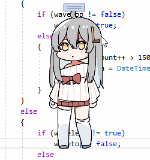
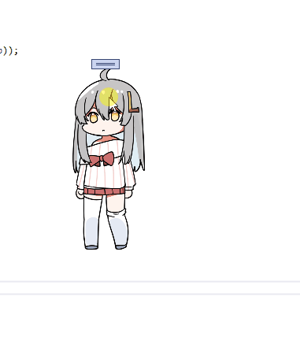
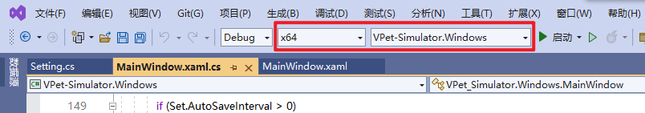

# VPet-Simulator

[简体中文](./README.md) | English

An open source desktop pet/shimeji/v-pet app, that can be embedded into any Windows Presentation Framework app as well.

Get VPet-Simulator [on Steam](https://store.steampowered.com/app/1920960/VPet) for free, or install its core library to your WPF app with [NuGet](https://www.nuget.org/packages/VPet-Simulator.Core).

## Introduction

***VPet-Simulator*** is an desktop pet app with various interactions implemented. It's open-source, free, and supports mods from the Steam Workshop. ~~Well, it's free, so why not try it out?~~

This game was originally developed for *[VUP-Simulator](https://store.steampowered.com/app/1352140/_/)*'s tutorial as an accompanying desktop pet, then split into an independent app. If you liked it, please consider adding VUP-Simulator to your wishlist.

### Many interactions and animations

Up to 32(types) * 4(states) * 3(variants) = 384 animations included! (Note that some types don't have ill versions or loops etc., so the actual number is slightly lower.)

#### Have some examples:

##### Head patting

##### Lifting

 

##### Wall climbing

See [image resources](https://github.com/LorisYounger/VPet#%E5%9B%BE%E5%83%8F%E8%B5%84%E6%BA%90) for more information.

### Free!

This game is **100% free**! ~~If it looks good for you, trying it out won't hurt.~~  
Our main goal is to promote [VUP-Simulator](https://store.steampowered.com/app/1352140/_/) with it; the default character here is the main character there.

### Open source!

The source of this game is available on GitHub. You can find it at: https://github.com/LorisYounger/VPet

Feature requests and pull requests are welcome! You can take our code and modify it to your liking, too. (Though most content don't require that and can be modded in.)

### Steam Workshop support

Steam Workshop mods are supported. With mods, you can add your own pets (animations/interactions) and share them to others through the Workshop.

The following contents can be added or modified by Workshop mods:

* Pet animations
* Items, foods and drinks, etc.
* Work
* Dialogue
* Themes
* Plugins - adding extra content to pets with code. For example:
  * New animation logic / solutions (e.g. Live2D and Spine)
  * New features (e.g. alarm and notes)
  * Basically anything - see [VPet.Plugin.Demo](https://github.com/LorisYounger/VPet.Plugin.Demo) for examples

### Contact us (for feedback and suggestions)

You can send your feedback and suggestions to:
  * The game's community on Steam
  * GitHub Issues
  * The [虚拟主播模拟器 "ba"/board](https://tieba.baidu.com/f?kw=%E8%99%9A%E6%8B%9F%E4%B8%BB%E6%92%AD%E6%A8%A1%E6%8B%9F%E5%99%A8) on Baidu Tieba
  * The VUP-Simulator QQ group (430081239)
  * Or my e-mail ([service@exlb.net](mailto:service@exlb.net))

## Software architecture

* **VPet-Simulator.Windows** - desktop pet simulator for the desktop
  * *Function* - for functional code
    * CoreMOD - mod management
    * MWController - window controller
  
  * *WinDesign* - for windows and UI design
    * winBetterBuy - Betterbuy window
    * winCGPTSetting - ChatGPT settings
    * winSetting - app settings/mod configuration
    * winConsole - console for dev purposes
    * winGameSetting - game settings
    * winReport - feedback center
  
  * MainWindows - main window; stores and presents the Core
  * PetHelper - for quick pet switching
* **VPet-Simulator.Tool** - tools that assist in creating mods, e.g. frame generator
* **VPet-Simulator.Core** - the app's core, for embedding into other WPF applications e.g. VUP-Simulator
  * Handle - interfaces and controls
    * IController - form controller; contains relevant functions and settings, such as moving to the side
    * Function - general functions
    * GameCore - the game's core; contains various data etc.
    * GameSave - save functionality
    * IFood - interface for items and food
    * PetLoader - animation loader
  * Graph - graphics rendering
    * IGraph - base interface for animations
    * GraphCore - core for animation displaying
    * GraphHelper - animation helper class
    * GraphInfo - animation information
    * FoodAnimation - specialized support for displaying 3-layer sandwich animations. not necessarily just for food, it's just the name
    * PNGAnimation - component for animated animations
    * Picture - component for static animations
  * Display - for displaying
    * basestyle/Theme - basic style
    * Main.xaml - core display component
      * MainDisplay - core display methods
      * MainLogic - core display logic
    * ToolBar - toolbar that shows up when pets are clicked on
    * MessageBar - dialogue bubble for when pets speak
    * WorkTimer - work timer

## Contributing

Welcome to participate in development! To ensure code maintainability and playability, if you wish to develop new features or gameplay, please first contact me (by sending a [mail](mailto:zoujin.dev@exlb.org) or opening an [Issue](https://github.com/LorisYounger/VPet/issues/new)) with your idea. This is to make sure your contribution fits the game, and will not get outright rejected for being unfitting (causing your effort to be wasted). You don't need to contact me regarding fixing errors or bugs - simply send a PR in that case.

After I approve your idea, you may [fork](https://github.com/LorisYounger/VPet/fork) the code repository and make your changes, then submit them by opening a [pull request](https://github.com/LorisYounger/VPet/compare). If it doesn't get approved, you can always create your own version of this game (that will be subject to [Apache License version 2.0](LICENSE) and the [animation copyright notice and authorization terms](#animation-copyright-notice-and-authorization-terms)).

Note that the addition of new features can normally be accomplished with plugins - see [VPet.Plugin.Demo](https://github.com/LorisYounger/VPet.Plugin.Demo) for more information.

To make sure the features/gameplay you contribute fit the game, I may make changes to your code.

Thanks to the following participating developers (in order of contribution):

* [Wreathlit](https://github.com/Wreathlit)

## Animation copyright notice and authorization terms

The copyright of the [pet animation files](./VPet-Simulator.Windows/mod/0000_core/pet/vup) provided in the source code belongs to [the VUP-Simulator team](https://www.exlb.net/VUP-Simulator). When using this game's core library in your application, you may either use your own animation files or ours. Providing that you follow the following terms, you may use our animations freely:

> **Note**
> This copyright notice only applies to the default animation files and doesn't apply to custom animation files created by third parties.

### For usage for non-commercial purposes

You **must** inform users of the source of our animation files, and provide a link to [this page](https://github.com/LorisYounger/VPet).

### For usage for commercial purposes

* Please contact me [through mail](mailto:zoujin.dev@exlb.org) first.
* On the first use of your application, you **must** show a pop-up window that prominently informs the user of the source of our animation files, and provides a link to [this page](https://github.com/LorisYounger/VPet).
* In a suitable page (that your users can easily access), you **must** inform the user of the source of our animation files, and provide a link to [this page](https://github.com/LorisYounger/VPet).
* You **must not** profit from our animation files by selling them.

### For distribution

* All of the above authorization information **must** be disclosed.
* You **must** provide a link to [this page](https://github.com/LorisYounger/VPet).
* **No** profit should be made with our files.

## How to deploy Vpet-Simulator.Windows

1. Download the source code, and open `VPet.sln` with Visual Studio.
2. Change the project to generate to `Vpet-Simulator.Windows`, and the configuration to `x64`.
   
3. Click on `Run`. If everything is OK, you will get the following message: `Lack Mod Core, Unable start desktop pet`
4. Run `mklink.bat` as administrator. This links the `mod` folder to the build folder.
5. Click on `Run` again, and this time the app will run.