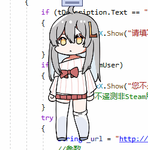
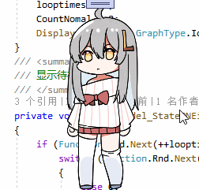
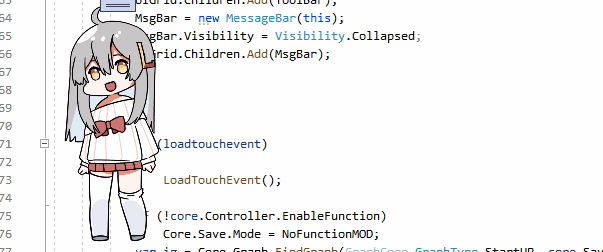
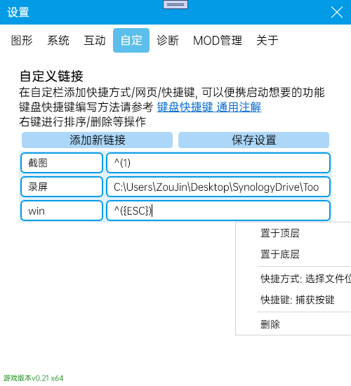

# 虚拟桌宠模拟器 使用教程

**本教程仅会在第一次启动/操作更新时自动打开** *如果你每次启动桌宠都能看到这个文件自动打开,那就是bug,请反馈给我*

桌宠默认会打开[数据计算](#数据计算), 打开数据计算后会计算桌宠心情/食物等消耗,需要玩家进行互动.可在设置中进行设置开关和设置游玩节奏

本游戏是核心是桌面宠物, 更多自动操作例如乱走乱动,发呆,蹲下等需要挂机才能看到.

## 基本操作

### 鼠标右键打开菜单栏

再次右键关闭

### 长按头/身子 提起进行移动

可在设置中设置长按时间

### 点击头部摸头

### 点击身体说话

### 摸头

### 摸身子

## 互动

### 投喂

点击投喂进行吃饭喝水, 吃/喝完后会立即补充一半的饱腹和口渴, 剩下一半将会缓慢增加

### 打工

通过互动 **文案**或**直播** 进行赚钱, 赚了钱后就可以给桌宠买食物饮料或者家具等(若有社区系统)

### 学习

学习以更快的获得经验值

### 睡觉

更少的体力消耗和加快回复体力, 适合挂机

## 数据计算

设置-互动中可以开关数据计算等相关操作

### 数据计算

开启后桌宠会有一系列需求,例如口渴饥饿心情等. 若只想挂着好看,关闭数据计算即可.

### 计算间隔

计算桌宠状态间隔. 时间越长,桌宠互动需求频率越长,消耗数值越慢. 反之亦然, 可以针对自己喜欢的风格自行调整

* 想要偶尔才给桌宠喂水/吃饭, 计算间隔越长越好
* 想要桌宠成长速度更快, 计算间隔越短越好

### 互动周期

决定桌宠在多少周期后决定自主行动,例如到处乱走乱爬. 周期越长频率越低

### 桌宠移动

决定桌宠是否允许进行位移操作, 关闭后桌宠会在原地不乱动

#### 智能移动

开启后,只有玩家交互的时候,桌宠才会进行移动,否则会待在原地不动

## 自定义链接

在自定栏添加快捷方式/网页/快捷键, 可以便携启动想要的功能
键盘快捷键编写方法请参考 [键盘快捷键](https://www.exlb.net/SendKeys) 通用注解
右键进行排序/删除等操作

保存设置后, 即可在桌宠菜单栏看到自定义的快捷键

## 数据介绍

### 金钱

可以用来在更好买中买东西吃喝,非常的有用

### 经验

提升玩家等级,等级越高打工学习获得的金钱/经验越高. 还会提高好感度上限

### 体力

和桌宠互动(摸头摸身体)消耗体力转换为心情

### 心情

保持良好状态和提高经验获取速度, 高心情还会增加好感度.

### 饱腹度

随时间消耗,低了桌宠会饿. 高饱腹度会恢复体力和提高健康

### 口渴度

随时间消耗,低了桌宠会渴. 高饱腹度会恢复体力和提高健康

### 健康(隐藏)

健康低了会生病, 生病会导致无法工作和学习

### 好感度(隐藏)

高好感度可以让身体更加健康, 也会会触发不同说话内容等隐藏事件.