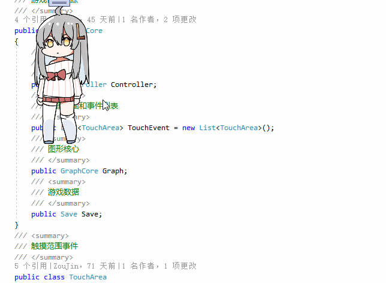
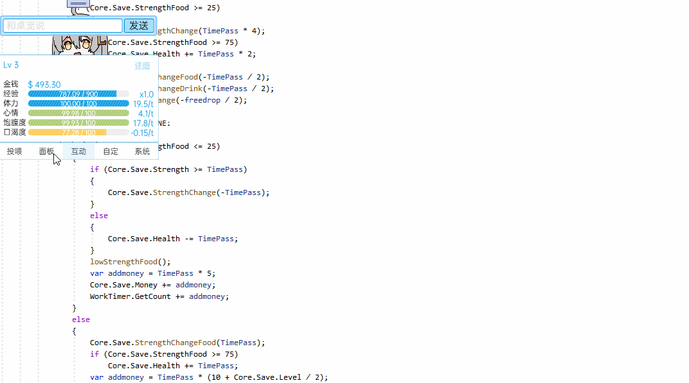
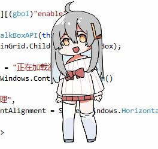
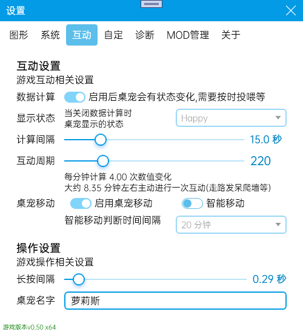

#  虛擬桌寵模擬器使用教程

**本教程僅會在第一次啟動/操作更新時自動打開** *如果你每次啟動桌寵都能看到這個檔自動打開，那就是bug，請迴響給我*

桌寵默認會打開[數據計算](#數據計算)，打開數據計算後會計算桌寵心情/食物等消耗，需要玩家進行互動.可在設定中進行設定開關和設定遊玩節奏

本遊戲是覈心是桌面寵物，更多自動操作例如亂走亂動，發呆，蹲下等需要掛機才能看到.

##  基本操作

### 滑鼠右鍵打開功能表列

再次右鍵關閉

### 長按頭/身子提起進行移動

可在設定中設定長按時間

### 點擊頭部摸頭

### 點擊身體說話

### 摸頭

### 摸身子

## 互動

### 投喂

點擊投喂進行吃飯喝水，吃/喝完後會立即補充一半的飽腹和口渴，剩下一半將會緩慢新增

### 打工

通過互動 **文案**或**直播** 進行賺錢，賺了錢後就可以給桌寵買食物飲料或者傢俱等(若有社區系統)

### 學習

學習以更快的獲得經驗值

### 睡覺

更少的體力消耗和加快回復體力，適合掛機

## 數據計算

設定-互動中可以開關數據計算等相關操作

### 數據計算

開啟後桌寵會有一系列需求，例如口渴饑餓心情等. 若只想掛著好看，關閉數據計算即可.

### 計算間隔

計算桌寵狀態間隔. 時間越長，桌寵互動需求頻率越長，消耗數值越慢. 反之亦然，可以針對自己喜歡的風格自行調整

*想要偶爾才給桌寵喂水/吃飯，計算間隔越長越好
*想要桌寵成長速度更快，計算間隔越短越好

### 互動週期

决定桌寵在多少週期後决定自主行動，例如到處亂走亂爬. 週期越長頻率越低

### 桌寵移動

决定桌寵是否允許進行位移操作，關閉後桌寵會在原地不亂動

#### 智慧移動

開啟後，只有玩家互動的時候，桌寵才會進行移動，否則會待在原地不動

## 自定義連結

在自定欄添加快捷方式/網頁/快速鍵，可以便攜啟動想要的功能
鍵盤快速鍵編寫方法請參攷[鍵盤快速鍵]( https://www.exlb.net/SendKeys )通用注解
右鍵進行排序/删除等操作

保存設置後，即可在桌寵功能表列看到自定義的快速鍵

## 數據介紹

### 金錢

可以用來在更好買中買東西吃喝，非常的有用

### 經驗

提升玩家等級，等級越高打工學習獲得的金錢/經驗越高. 還會提高好感度上限

### 體力

和桌寵互動(摸頭摸身體)消耗體力轉換為心情

### 心情

保持良好狀態和提高經驗獲取速度，高心情還會新增好感度.

### 飽腹度

隨時間消耗，低了桌寵會餓. 高飽腹度會恢復體力和提高健康

### 口渴度

隨時間消耗，低了桌寵會渴. 高飽腹度會恢復體力和提高健康

### 健康(隱藏)

健康低了會生病，生病會導致無法工作和學習

### 好感度(隱藏)

高好感度可以讓身體更加健康，也會會觸發不同說話內容等隱藏事件.