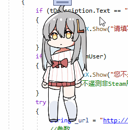

#  虛擬桌寵模擬器使用教學

**本教學只會在首次啟動／操作更新時自動開啟**

*若您每次啟動桌寵，這個檔案都會自動開啟，那就是出bug了，請回報給作者*

桌寵預設會打開[資料計算](#資料計算)。打開資料計算後，會自動計算桌寵心情／食物等數值，需要玩家進行互動。可以在設定中啟用／停用或設定變化頻率

本遊戲的核心是桌面寵物，更多自動行為如亂走亂動、發呆、蹲下等，需要掛機才能看見。

## 11/24 更新捏臉
捏臉動畫為2023年的steam大獎提名活動
長按臉部捏臉

##  基本操作

### 滑鼠右鍵打開功能表

再次右鍵即可關閉

### 長按頭部／身體，可進行移動

可在設定中設定長按時間

### 點擊頭部摸頭

### 點擊身體說話

### 摸頭

### 摸身體

## 互動

### 投餵

點擊投餵能夠吃飯喝水等等，吃喝完後，會立即補充物品一半的飽食度及口渴值，另一半則會慢慢回復

### 打工

透過互動中的**寫作**或**實況**可以賺錢。有錢後，就能夠給桌寵買更多的食物、飲料或家具等等（如有社群系統）

### 學習

學習可以更快地獲得經驗值

### 睡覺

消耗更少體力並加速體力回復，適合掛機

## 資料計算

在\[設定-互動\]中可以啟用／停用資料計算等相關內容

### 資料計算

啟用時，桌寵會有一系列需求，例如口渴、饑餓、心情等。若只想掛著好看，可以停用資料計算。

### 計算間隔

計算桌寵狀態的間隔時間。時間越長，桌寵互動需求的產生頻率越小，消耗數值越慢，反之亦然。可以針對自己喜歡的風格自行調整。

※想要偶爾才給桌寵喝水／吃飯，計算間隔越長越好

※想要桌寵成長速度更快，計算間隔越短越好

### 互動週期

决定桌寵在多少週期後會自主行動，例如到處亂走亂爬。週期越長，自主行動的頻率越低。

### 桌寵移動

决定桌寵是否能夠位移。停用時，桌寵會在原地不亂動。

#### 智慧移動

啟用時，只有玩家互動的時候，桌寵才會進行移動，否則會待在原地不動。

## 自訂連結

在自訂欄位中加入捷徑／網頁／快捷鍵，可以方便快速地啟動想要的功能

鍵盤快捷鍵的編寫方式請參考[鍵盤快捷鍵]( https://www.exlb.net/SendKeys )通用注解

右鍵能夠改變排序／删除等

儲存設定後，即可在桌寵的功能表中看到自訂快捷鍵

## 數據簡介

### 財產

可以在更好買商店中買吃買喝買東西，非常有用

### 經驗

提升桌寵等級。等級越高，打工、學習獲得的金錢／經驗值就越多，並會提高好感度上限

### 體力

和桌寵互動（摸頭、摸身體）會消耗體力並轉換成心情

### 心情

維持良好的狀態，並提高經驗值的獲取速度，高心情還會增加好感度

### 飽食度

隨時間消耗。低了桌寵會餓，高飽食度會恢復體力並提高健康值

### 口渴度

隨時間消耗。低了桌寵會渴，高飽食度會恢復體力並提高健康值

### 健康值（隱藏屬性）

健康值過低會生病，生病會導致無法工作或學習

### 好感度（隱藏屬性）

高好感度可以讓身體更加健康，也會觸發隱藏事件，例如擁有不同的對話內容等等
